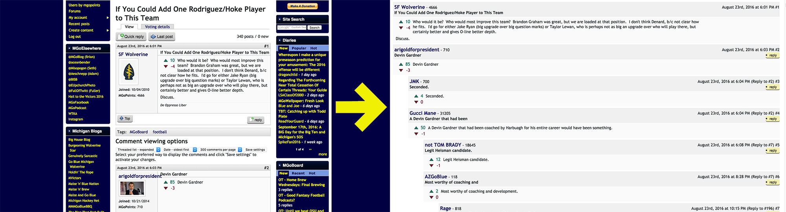
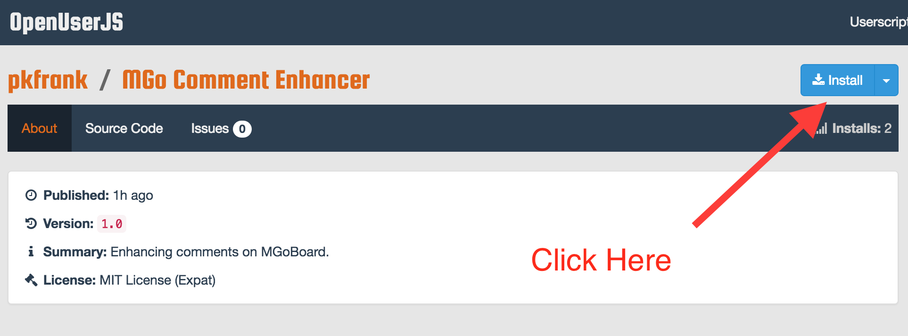
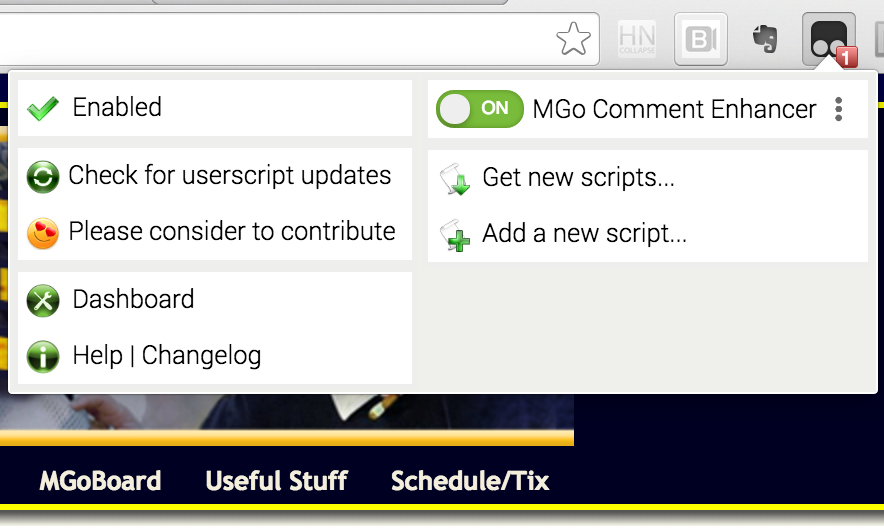

# MGo Comment Enhancer
*Making MGoBoard a little more readable*

## Background
I'm a huge fan and reader of [MGoBlog](http://MGoBlog.com), and the community at [MGoBoard](http://mgoblog.com/mgoboard).  However, I've been a little bit frustrated with the visual layout of the forum on desktop (the mobile apps ([iOs](https://itunes.apple.com/us/app/mgoblog-hd/id819662017?mt=8)/[Android](https://play.google.com/store/apps/details?id=com.atami.mgodroid&hl=en)) are awesome...).  In my opinion, there's a lot of wasted vertical space, and it can feel crowded with the sidebars, author signatures, and profile pictures, making it difficult to follow the conversation.

I put together a little script to modify the HTML/CSS of the page to produce (what I think is) a cleaner and more compact overall look.

The script activates when it detects the MGoBlog.com/MGoBoard URL, and only modifies information already sent to the end-user's browser; it does not interact directly with the MGoBlog servers.

## Installation
The script can be installed using [TamperMonkey](http://tampermonkey.net/), which is a well-supported and open-source userscript manager that supports most major browsers.

The installation file can be accessed at https://openuserjs.org/scripts/pkfrank/MGo_Comment_Enhancer

Once you've installed TamperMonkey, simply click "Install" at the above link to add the script to your browser.  You can toggle it on/off at any time.

**Recap**:

Step 1) Install [TamperMonkey](http://tampermonkey.net/)

Step 2) Go to [this link](https://openuserjs.org/scripts/pkfrank/MGo_Comment_Enhancer)

Step 3) Click install

Step 4) Navigate to MGoBoard

Step 5) Make sure it's "enabled" via TamperMonkey (you might need to refresh)

## Technical Notes
I put this together over a weekend or two using Javascript/JQuery.  I'm a complete novice, so it's probably not as efficient/clean as it could be.  Please contribute if you see missing features or have ideas to make it better.

I'm including an Example.html and the corresponding files to make it easier to test in a local environment.

I'm also curious to know how much "page weight" the extension adds.  My estimation is that it doesn't really impact loading time, but I'd love to eventually have some empirical data to back that up.

Anyway, this project is open-source under the MIT License, and I welcome you to do whatever you want with it.

##Contact
Problems? Comments? MGoSnark?

Ping me here, on Twitter [@PeterKimFrank](http://twitter.com/peterkimfrank), or via email at peter.kim.frank -at- gmail

**GO BLUE.**